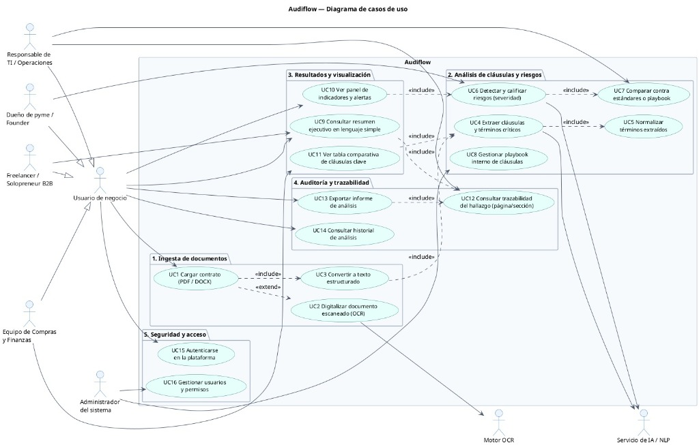

# Audiflow — Diagrama de Casos de Uso

**Proyecto**: Audiflow — Asistente de Auditoría y Cumplimiento Regulatorio para Contratos Financieros o de Software  
**Autor**: Eduardo Pedroza, Daysmir Hugueth, Antonio Guerrero (@Eduarpj97)  
**Versión**: 2.0  

---

## 1. Diagrama Visual de Casos de Uso

---

## 2. Diagrama de Casos de Uso en Notación Mermaid

\\\mermaid
flowchart LR
    %% Actores de Negocio
    subgraph Actores_Negocio [" Perfiles de Usuario de Negocio "]
        TI["👤 Responsable de TI / Operaciones"]
        Founder["👤 Dueño de pyme / Founder"]
        Freelancer["👤 Freelancer / Solopreneur B2B"]
        Finanzas["👤 Equipo de Compras y Finanzas"]
        UserNegocio["👤 Usuario de negocio"]
    end

    %% Generalización de usuarios
    TI --> UserNegocio
    Founder --> UserNegocio
    Freelancer --> UserNegocio
    Finanzas --> UserNegocio

    %% Actores del Sistema y Soporte
    Admin["👤 Administrador del sistema"]
    OCR["⚙️ Motor OCR"]
    IANLP["🤖 Servicio de IA / NLP"]

    %% Sistema Audiflow
    subgraph Audiflow [" Sistema Audiflow "]
        
        subgraph Mod1 [" 1. Ingesta de documentos "]
            UC1(["UC1 Cargar contrato (PDF / DOCX)"])
            UC2(["UC2 Digitalizar documento escaneado (OCR)"])
            UC3(["UC3 Convertir a texto estructurado"])
        end

        subgraph Mod2 [" 2. Análisis de cláusulas y riesgos "]
            UC4(["UC4 Extraer cláusulas y términos críticos"])
            UC5(["UC5 Normalizar términos extraídos"])
            UC6(["UC6 Detectar y calificar riesgos (severidad)"])
            UC7(["UC7 Comparar contra estándares o playbook"])
            UC8(["UC8 Gestionar playbook interno de cláusulas"])
        end

        subgraph Mod3 [" 3. Resultados y visualización "]
            UC9(["UC9 Consultar resumen ejecutivo en lenguaje simple"])
            UC10(["UC10 Ver panel de indicadores y alertas"])
            UC11(["UC11 Ver tabla comparativa de cláusulas clave"])
        end

        subgraph Mod4 [" 4. Auditoría y trazabilidad "]
            UC12(["UC12 Consultar trazabilidad del hallazgo (página/sección)"])
            UC13(["UC13 Exportar informe de análisis"])
            UC14(["UC14 Consultar historial de análisis"])
        end

        subgraph Mod5 [" 5. Seguridad y acceso "]
            UC15(["UC15 Autenticarse en la plataforma"])
            UC16(["UC16 Gestionar usuarios y permisos"])
        end

    end

    %% Relaciones Usuario de Negocio
    UserNegocio --> UC1
    UserNegocio --> UC9
    UserNegocio --> UC10
    UserNegocio --> UC11
    UserNegocio --> UC13
    UserNegocio --> UC14
    UserNegocio --> UC15

    %% Relaciones específicas Responsable TI
    TI --> UC7
    TI --> UC8

    %% Relaciones Administrador
    Admin --> UC15
    Admin --> UC16

    %% Relaciones Includes y Extends
    UC1 -.->|<<extend>>| UC2
    UC1 -.->|<<include>>| UC3
    UC4 -.->|<<include>>| UC5
    UC6 -.->|<<include>>| UC7
    UC10 -.->|<<include>>| UC6
    UC11 -.->|<<include>>| UC4
    UC13 -.->|<<include>>| UC12
    UC12 -.->|<<include>>| UC4

    %% Relaciones con Motores de Servicio
    UC2 --> OCR
    UC3 --> IANLP
    UC4 --> IANLP
    UC6 --> IANLP
\\\

---

## 3. Identificación y Definición de Actores

| Actor | Tipo | Descripción |
|---|---|---|
| **Usuario de negocio** | Humano (General) | Rol base que engloba las necesidades operativas de revisión contractual en la organización. |
| **Responsable de TI / Operaciones** | Humano (Especializado) | Evalúa SLAs de infraestructura, software y gestiona el playbook de cláusulas técnicas. |
| **Dueño de pyme / Founder** | Humano (Especializado) | Requiere visión ejecutiva rápida de riesgos legales, pasivos financieros y cláusulas abusivas. |
| **Freelancer / Solopreneur B2B** | Humano (Especializado) | Verifica condiciones de pago, derechos de propiedad intelectual y exclusividad. |
| **Equipo de Compras y Finanzas** | Humano (Especializado) | Audita penalidades, costos recurrentes, renovaciones tácitas y términos de terminación. |
| **Administrador del sistema** | Humano | Gestiona altas, bajas, roles, permisos y seguridad de la plataforma. |
| **Motor OCR** | Sistema / Subsistema | Módulo óptico que procesa imágenes o PDFs escaneados convirtiéndolos en texto operable. |
| **Servicio de IA / NLP** | Sistema / Subsistema | Motor de Inteligencia Artificial (RAG / Ollama / LangChain) que analiza semántica y severidad. |

---

## 4. Catálogo Detallado de Casos de Uso (Audiflow)

### Módulo 1: Ingesta de Documentos
- **UC1: Cargar contrato (PDF / DOCX)**
  - *Actor*: Usuario de negocio.
  - *Descripción*: Permite cargar documentos digitales en formatos PDF o DOCX para su procesamiento.
  - *Relaciones*: <<include>> UC3, <<extend>> UC2.
- **UC2: Digitalizar documento escaneado (OCR)**
  - *Actor*: Motor OCR.
  - *Descripción*: Si el archivo carece de capa de texto vectorial, se activa el motor de reconocimiento óptico de caracteres para extraer el contenido.
- **UC3: Convertir a texto estructurado**
  - *Actor*: Servicio de IA / NLP.
  - *Descripción*: Normaliza y limpia el texto, identificando títulos, numerales y párrafos contractuales.

### Módulo 2: Análisis de Cláusulas y Riesgos
- **UC4: Extraer cláusulas y términos críticos**
  - *Actor*: Servicio de IA / NLP.
  - *Descripción*: Identifica cláusulas de penalización, terminación anticipada, SLA, jurisdicción y privacidad.
  - *Relaciones*: <<include>> UC5.
- **UC5: Normalizar términos extraídos**
  - *Actor*: Servicio de IA / NLP.
  - *Descripción*: Homologa conceptos jurídicos dispares a un vocabulario estándar de auditoría.
- **UC6: Detectar y calificar riesgos (severidad)**
  - *Actor*: Servicio de IA / NLP.
  - *Descripción*: Asigna niveles de severidad cuantitativos y cualitativos (Rojo = Crítico, Amarillo = Advertencia, Verde = Conforme).
  - *Relaciones*: <<include>> UC7.
- **UC7: Comparar contra estándares o playbook**
  - *Actor*: Responsable de TI / Servicio de IA.
  - *Descripción*: Contrasta los términos del contrato analizado frente a las políticas estándar de la empresa o normativas de referencia.
- **UC8: Gestionar playbook interno de cláusulas**
  - *Actor*: Responsable de TI / Operaciones.
  - *Descripción*: Permite definir y actualizar las reglas de aceptación, umbrales de SLA permitidos y cláusulas no negociables.

### Módulo 3: Resultados y Visualización
- **UC9: Consultar resumen ejecutivo en lenguaje simple**
  - *Actor*: Usuario de negocio.
  - *Descripción*: Muestra una síntesis no técnica del contrato orientada a la toma rápida de decisiones gerenciales.
- **UC10: Ver panel de indicadores y alertas**
  - *Actor*: Usuario de negocio.
  - *Descripción*: Dashboard visual con semáforo global, porcentaje de riesgo y tarjetas de alerta inmediata.
  - *Relaciones*: <<include>> UC6.
- **UC11: Ver tabla comparativa de cláusulas clave**
  - *Actor*: Usuario de negocio.
  - *Descripción*: Vista tabular interactiva que contrapone lo establecido en el contrato vs lo estipulado en el playbook estándar.
  - *Relaciones*: <<include>> UC4.

### Módulo 4: Auditoría y Trazabilidad
- **UC12: Consultar trazabilidad del hallazgo (página/sección)**
  - *Actor*: Usuario de negocio / Servicio de IA.
  - *Descripción*: Vincula cada riesgo y cláusula extraída con el fragmento exacto y número de página original del documento.
  - *Relaciones*: <<include>> UC4.
- **UC13: Exportar informe de análisis**
  - *Actor*: Usuario de negocio.
  - *Descripción*: Genera y descarga un reporte formal en PDF con la auditoría integral y sus evidencias.
  - *Relaciones*: <<include>> UC12.
- **UC14: Consultar historial de análisis**
  - *Actor*: Usuario de negocio.
  - *Descripción*: Permite consultar auditorías previas, versiones comparativas y evolución contractual de proveedores.

### Módulo 5: Seguridad y Acceso
- **UC15: Autenticarse en la plataforma**
  - *Actor*: Usuario de negocio / Administrador.
  - *Descripción*: Control de acceso seguro mediante credenciales o tokens.
- **UC16: Gestionar usuarios y permisos**
  - *Actor*: Administrador del sistema.
  - *Descripción*: Administración de cuentas corporativas, roles y niveles de confidencialidad de la información.
