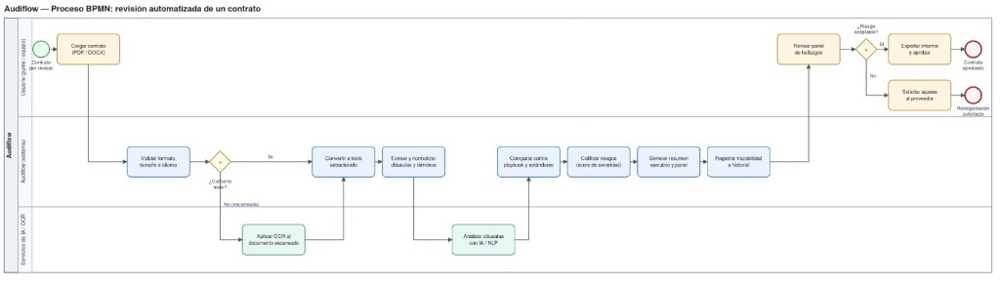

# Audiflow — Proceso BPMN: Revisión Automatizada de un Contrato

**Proyecto**: Audiflow — Asistente de Auditoría y Cumplimiento Regulatorio para Contratos Financieros o de Software  
**Autor**: Eduardo (@Eduarpj97)  
**Versión**: 2.0  

---

## 1. Diagrama Visual del Proceso BPMN

---

## 2. Diagrama de Proceso en Notación Mermaid (Lanes / Carriles)

\\\mermaid
flowchart TD
    %% Carril Usuario
    subgraph Lane_Usuario [" Carril 1: Usuario (pyme / equipo) "]
        StartNode([🟢 Contrato por revisar]) --> Task_Cargar[Cargar contrato   PDF / DOCX]
        Task_Revisar[Revisar panel   de hallazgos]
        Gate_Riesgo{¿Riesgo   aceptable?}
        Task_Aprobar[Exportar informe   y aprobar] --> End_Aprobado([🔴 Contrato   aprobado])
        Task_Ajustes[Solicitar ajustes   al proveedor] --> End_Renegociar([🔴 Renegociación   solicitada])
    end

    %% Carril Audiflow Sistema
    subgraph Lane_Sistema [" Carril 2: Audiflow (sistema) "]
        Task_Validar[Validar formato,   tamaño e idioma]
        Gate_Texto{¿Contiene   texto?}
        Task_Convertir[Convertir a   texto estructurado]
        Task_Extraer[Extraer y normalizar   cláusulas y términos]
        Task_Playbook[Comparar contra   playbook y estándares]
        Task_Calificar[Calificar riesgos   score de severidad]
        Task_Resumen[Generar resumen   ejecutivo y panel]
        Task_Trazabilidad[Registrar trazabilidad   e historial]
    end

    %% Carril Servicios de IA / OCR
    subgraph Lane_Servicios [" Carril 3: Servicios de IA / OCR "]
        Task_OCR[Aplicar OCR al   documento escaneado]
        Task_IA[Analizar cláusulas   con IA / NLP]
    end

    %% Conexiones entre carriles (Flujo de Secuencia)
    Task_Cargar --> Task_Validar
    Task_Validar --> Gate_Texto
    
    %% Compuerta ¿Contiene texto?
    Gate_Texto -- "Sí" --> Task_Convertir
    Gate_Texto -- "No (escaneado)" --> Task_OCR
    Task_OCR --> Task_Convertir

    %% Procesamiento de cláusulas con IA
    Task_Convertir --> Task_Extraer
    Task_Extraer --> Task_IA
    Task_IA --> Task_Playbook

    %% Flujo de auditoría y scoring
    Task_Playbook --> Task_Calificar
    Task_Calificar --> Task_Resumen
    Task_Resumen --> Task_Trazabilidad

    %% Retorno al usuario para toma de decisión
    Task_Trazabilidad --> Task_Revisar
    Task_Revisar --> Gate_Riesgo
    Gate_Riesgo -- "Sí" --> Task_Aprobar
    Gate_Riesgo -- "No" --> Task_Ajustes

    %% Estilos visuales acordes a BPMN
    classDef startEvent fill:#dcfce7,stroke:#16a34a,stroke-width:2px;
    classDef endEvent fill:#fee2e2,stroke:#dc2626,stroke-width:2px;
    classDef userTask fill:#fef3c7,stroke:#d97706,stroke-width:1.5px;
    classDef sysTask fill:#dbeafe,stroke:#2563eb,stroke-width:1.5px;
    classDef serviceTask fill:#ccfbf1,stroke:#0d9488,stroke-width:1.5px;
    classDef gateway fill:#fef08a,stroke:#ca8a04,stroke-width:1.5px;

    class StartNode startEvent;
    class End_Aprobado,End_Renegociar endEvent;
    class Task_Cargar,Task_Revisar,Task_Aprobar,Task_Ajustes userTask;
    class Task_Validar,Task_Convertir,Task_Extraer,Task_Playbook,Task_Calificar,Task_Resumen,Task_Trazabilidad sysTask;
    class Task_OCR,Task_IA serviceTask;
    class Gate_Texto,Gate_Riesgo gateway;
\\\

---

## 3. Descripción Detallada de los Carriles (Pools / Lanes)

### Carril 1: Usuario (pyme / equipo)
Representa al usuario final del sistema (fundadores, directores de operaciones, equipos de compras o finanzas).
- **Contrato por revisar (Evento de inicio)**: Se recibe un nuevo contrato legal, SLA o licencia de software de un proveedor o cliente.
- **Cargar contrato (PDF / DOCX)**: El usuario sube el documento a la plataforma web arrastrándolo o seleccionándolo.
- **Revisar panel de hallazgos**: El usuario analiza los resultados en el dashboard interactivo (cláusulas detectadas, nivel de severidad y citas de página).
- **¿Riesgo aceptable? (Compuerta exclusiva XOR)**:
  - **Rama SÍ**: El riesgo está dentro de los límites tolerables. Se ejecuta **Exportar informe y aprobar**, culminando en el evento final **Contrato aprobado**.
  - **Rama NO**: Existen cláusulas leoninas, penalidades desmedidas o SLAs insuficientes. Se ejecuta **Solicitar ajustes al proveedor**, culminando en el evento final **Renegociación solicitada**.

---

### Carril 2: Audiflow (sistema)
Orquestador central del backend que gestiona el pipeline de validación, transformación de datos y reglas de negocio.
1. **Validar formato, tamaño e idioma**: Comprueba que el archivo sea .pdf o .docx, que su peso no supere los límites establecidos y que el idioma sea soportado.
2. **¿Contiene texto? (Compuerta de decisión)**: Determina si el PDF contiene capas de texto nativo seleccionable o si es un documento escaneado/fotocopiado.
3. **Convertir a texto estructurado**: Reensambla el contenido textual en un esquema jerárquico estructurado (secciones, numerales, anexos).
4. **Extraer y normalizar cláusulas y términos**: Prepara los prompts y embeddings semánticos para remitirlos al motor de IA.
5. **Comparar contra playbook y estándares**: Contrasta las condiciones detectadas frente a las políticas corporativas (ej. SLA mínimo del 99.9%, límite de responsabilidad equivalente a 12 meses de servicio, penalidad máxima del 10%).
6. **Calificar riesgos (score de severidad)**: Calcula la severidad global y por cláusula utilizando una escala de riesgo (🔴 Alta, 🟡 Media, 🟢 Baja).
7. **Generar resumen ejecutivo y panel**: Compila la explicación en lenguaje sencillo y prepara los datos para la interfaz visual.
8. **Registrar trazabilidad e historial**: Guarda la auditoría en base de datos vinculando cada hallazgo con la página, párrafo y marca temporal.

---

### Carril 3: Servicios de IA / OCR
Subsistemas especializados de procesamiento computacional avanzado.
- **Aplicar OCR al documento escaneado**: Motor óptico (Tesseract / EasyOCR / Document AI) para extraer texto de imágenes y escaneos de baja resolución.
- **Analizar cláusulas con IA / NLP**: Modelo de lenguaje (RAG con LangChain / Ollama local con Llama 3.1) que infiere intenciones, obligaciones, ambigüedades y pasivos regulatorios.